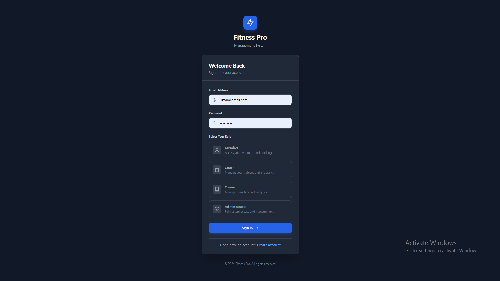
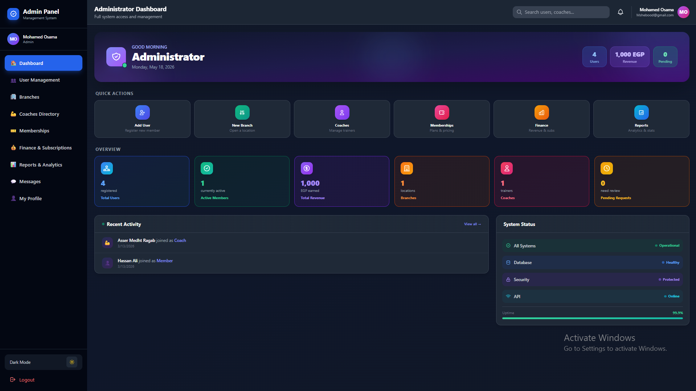
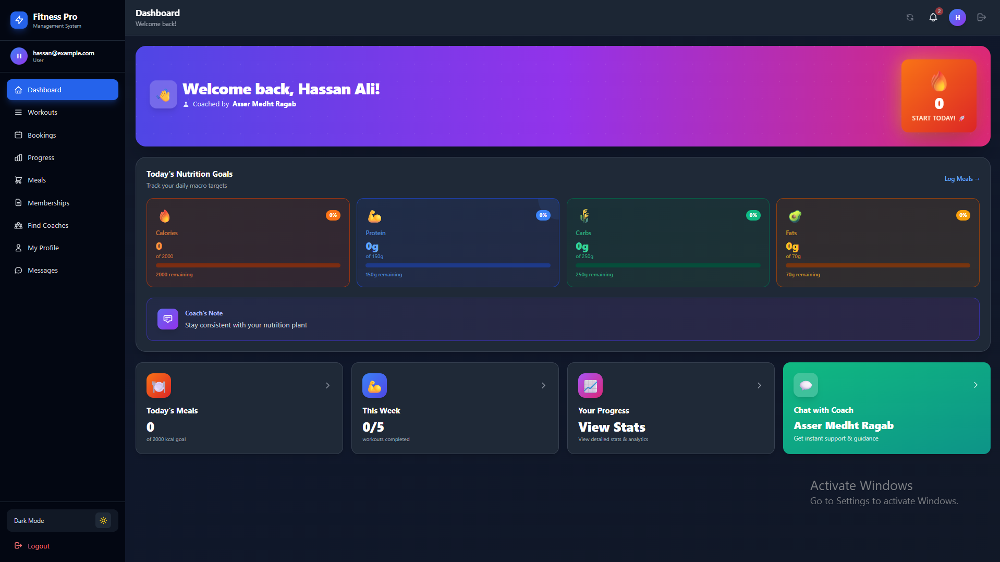
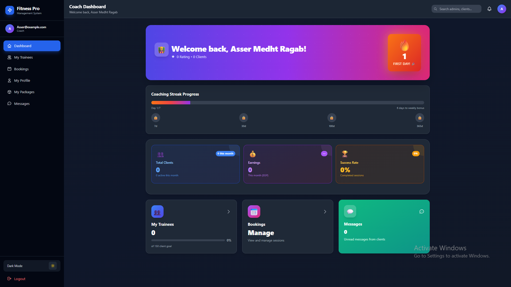
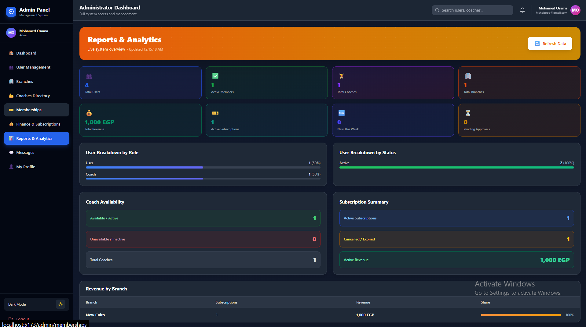
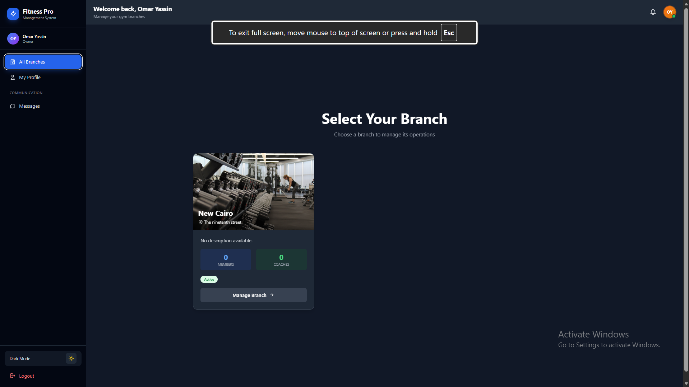

# 🏋️ SmartGym — Gym Management SaaS Platform

> A full-stack, multi-role gym management system built with FastAPI, React, and Azure SQL — deployed on Railway + Netlify.

🔗 **Live Demo:** [smart-gym-system.netlify.app](https://smart-gym-system.netlify.app)

---

## 📸 Screenshots

| Login | Admin Dashboard |
|-------|----------------|
|  |  |

| Member Dashboard | Coach Dashboard |
|-----------------|----------------|
|  |  |

| Reports & Analytics | Owner Panel |
|--------------------|------------|
|  |  |

---

## 📌 Overview

SmartGym is a production-grade SaaS platform that allows gym businesses to manage their entire operations digitally — from member subscriptions and coach scheduling to real-time chat and multi-branch reporting.

Built with a clean separation between backend and frontend, containerized with Docker, and deployed on cloud infrastructure.

---

## ✨ Features

### 👥 Multi-Role System
| Role | Capabilities |
|------|-------------|
| **Owner** | Multi-branch dashboard, reports, coach management, subscriptions |
| **Admin** | Member management, gym configuration, user management, finance & analytics |
| **Coach** | Training programs, trainee tracking, bookings, streak progress, earnings |
| **Member** | Workout plans, meal plans, nutrition goals, bookings, progress tracking |

### 🔐 Authentication & Security
- JWT-based authentication with token blacklisting
- Role-based access control (RBAC) on every endpoint
- Membership ID / Staff ID activation flow for new users
- SQL injection prevention and CRLF normalization
- Password reset via email with secure tokens

### 💬 Real-Time Chat
- Conversation system between all user roles
- File & image sharing via Cloudinary
- Unread message notifications

### 📊 Dashboard & Analytics
- Multi-branch performance overview for owners
- Revenue by branch with live stats
- Member progress tracking (weight log, calories, workouts)
- Coach streak progress and earnings tracking
- Full Reports & Analytics page with user breakdown charts

### 🍽️ Additional Modules
- Nutrition goals with macro tracking (calories, protein, carbs, fats)
- Meal plan management
- Workout & training program builder
- Coach availability & booking system
- Coach directory with specialties and ratings
- Push notifications center
- Member reviews & ratings
- Finance & subscriptions management

---

## 🛠️ Tech Stack

### Backend


- **FastAPI** — async REST API with automatic OpenAPI docs
- **Azure SQL** (UAE North) — production relational database
- **SQLAlchemy** — ORM with relationship management
- **Docker + ODBC Driver 18** — containerized deployment
- **Railway** — backend hosting with environment secrets
- **Cloudinary** — file and image upload storage
- **JWT** — secure token-based auth

### Frontend


- **React 18** with Context API for state management
- **Vite** for fast builds
- **Tailwind CSS** for responsive UI with dark mode support
- **Axios** HTTP client with interceptors

---

## 🏗️ Architecture

```
SmartGym/
├── Backend/
│   └── Backend-final/
│       ├── app/
│       │   ├── api/v1/          # All route handlers
│       │   ├── models/          # SQLAlchemy ORM models
│       │   ├── schemas/         # Pydantic request/response schemas
│       │   ├── services/        # Business logic layer
│       │   ├── core/            # Security, JWT, exceptions
│       │   └── utils/           # Cloudinary, helpers
│       ├── Dockerfile
│       ├── requirements.txt
│       └── railway.json
└── frontend/
    └── src/
        ├── pages/               # Owner / Admin / Coach / User dashboards
        ├── components/          # Shared UI components + Chat
        ├── context/             # Auth, Chat, Notification, Profile contexts
        └── services/            # API service layer
```

---

## 🚀 Getting Started

### Prerequisites
- Python 3.12+
- Node.js 18+
- Docker (optional)
- Azure SQL or any MSSQL instance

### Backend Setup

```bash
cd Backend/Backend-final

# Install dependencies
pip install -r requirements.txt

# Create .env file from example
cp .env.example .env
# Fill in your DATABASE_URL, SECRET_KEY, CLOUDINARY_* keys

# Run locally
uvicorn app.main:app --reload
```

API docs available at: `http://localhost:8000/docs`

### Frontend Setup

```bash
cd frontend

# Install dependencies
npm install

# Create env file
echo "VITE_API_URL=http://localhost:8000/api/v1" > .env.local

# Run dev server
npm run dev
```

### Docker Deployment

```bash
cd Backend/Backend-final
docker build -t smartgym-backend .
docker run -p 8000:8000 --env-file .env smartgym-backend
```

---

## 🌐 Deployment

| Service | Platform | Notes |
|---------|----------|-------|
| Backend API | Railway | Auto-deploy from GitHub, ODBC Driver 18 |
| Database | Azure SQL (UAE North) | Production instance |
| Frontend | Netlify | Auto-deploy, `_redirects` for SPA routing |
| File Storage | Cloudinary | Images and chat attachments |

---

## 📡 API Highlights

The API follows REST conventions with versioning under `/api/v1/`:

- `POST /api/v1/auth/login` — JWT login
- `GET /api/v1/gyms/` — list branches (owner)
- `POST /api/v1/workouts/` — create workout plan (coach)
- `GET /api/v1/meals/` — get meal plans (member)
- `POST /api/v1/chat/conversations/` — start a conversation
- `GET /api/v1/notifications/` — fetch notifications

Full interactive docs: `{backend_url}/docs`

---

## 👨‍💻 Author

**Mohamed Osama** — AI Engineer & Full-Stack Developer

[](https://linkedin.com/in/mohamed-osama-558786285)
[](https://github.com/MohamedOsama-10)

---

## 📄 License

This project is for portfolio and demonstration purposes.
